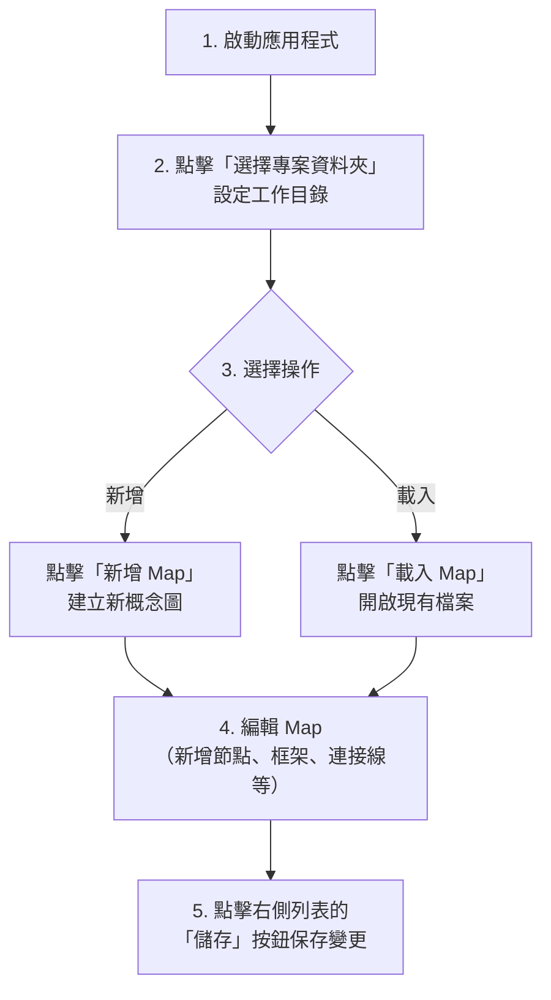

# Concept Crafter - Electron 版本

這是 Concept Crafter 的 Electron 桌面應用程式版本，提供完整的檔案系統訪問權限。

## 特色

✅ **完整檔案訪問**：直接訪問本地檔案系統，無瀏覽器安全限制
✅ **獨立應用程式**：不依賴瀏覽器，打包成可執行檔
✅ **跨平台支援**：Windows、macOS、Linux
✅ **純 Electron 實作**：專為桌面環境優化，無瀏覽器相容程式碼

## 安裝依賴

首先確保已安裝 Node.js (建議 v16 以上)，然後執行：

```bash
npm install
```

## 開發模式運行

```bash
npm start
```

這會啟動 Electron 應用程式，可以直接測試功能。

## 打包成可執行檔

### 打包所有平台

```bash
npm run build
```

### 只打包特定平台

```bash
# Windows
npm run build:win

# macOS
npm run build:mac

# Linux
npm run build:linux
```

打包後的檔案會在 `dist/` 目錄中：

- **Windows**: `ConceptCrafter-2.6.12-win.exe`
- **macOS**: `ConceptCrafter-2.6.12-mac.dmg`
- **Linux**: `ConceptCrafter-2.6.12-linux.AppImage`

## 使用說明

1. **選擇專案資料夾**：點擊「選擇專案資料夾」按鈕，設定工作目錄
2. **建立新 Map**：點擊「新增 Map」建立新的概念圖
3. **儲存 Map**：點擊右側列表中的「儲存」按鈕將 Map 儲存為 HTML 檔案
4. **載入 Map**：點擊「載入 Map」手動選擇要開啟的 HTML 檔案
5. **管理 Maps**：在右側列表中可以切換、儲存、移除或刪除 Maps

## 使用者工作流程



**重要提示**：

- 選擇專案資料夾後**不會自動掃描**或載入任何檔案
- 必須手動建立新 Map 或載入現有檔案
- Map 列表只顯示本次工作階段中建立或載入的 Maps

## 專案結構

```text
ConceptCrafter/
├── main.js                  # Electron 主進程
├── preload.js              # 預載腳本（安全橋接）
├── concept-crafter.html    # 渲染進程（UI）
├── package.json            # 專案設定
└── dist/                   # 打包輸出目錄
```

## 技術細節

- **Electron**: ^28.0.0
- **Node.js**: v16+
- **支援平台**: Windows 7+, macOS 10.13+, Ubuntu 18.04+

## 開發說明

### 主要檔案

1. **main.js**: Electron 主進程，處理檔案系統操作
2. **preload.js**: 安全橋接層，暴露 API 給渲染進程
3. **concept-crafter.html**: UI 和業務邏輯（純 Electron 版本，無瀏覽器相容程式碼）

### IPC 通訊

主進程和渲染進程通過 IPC (Inter-Process Communication) 溝通：

```javascript
// 渲染進程調用
const folderPath = await window.electronAPI.selectFolder();

// 主進程處理
ipcMain.handle('select-folder', async () => {
    const result = await dialog.showOpenDialog(...);
    return result.filePaths[0];
});
```

## 故障排除

### Windows: 應用程式被防毒軟體攔截

某些防毒軟體可能會標記未簽名的應用程式。如需簽名，請參考 electron-builder 的文件。

### macOS: 應用程式無法開啟

如果出現「無法打開，因為它來自未識別的開發者」：

```bash
xattr -cr /Applications/ConceptCrafter.app
```

### Linux: AppImage 無法執行

確保檔案有執行權限：

```bash
chmod +x ConceptCrafter-1.0.0-linux.AppImage
```

## 授權

MIT License

## 回饋與貢獻

如有問題或建議，歡迎提出 Issue 或 Pull Request。
